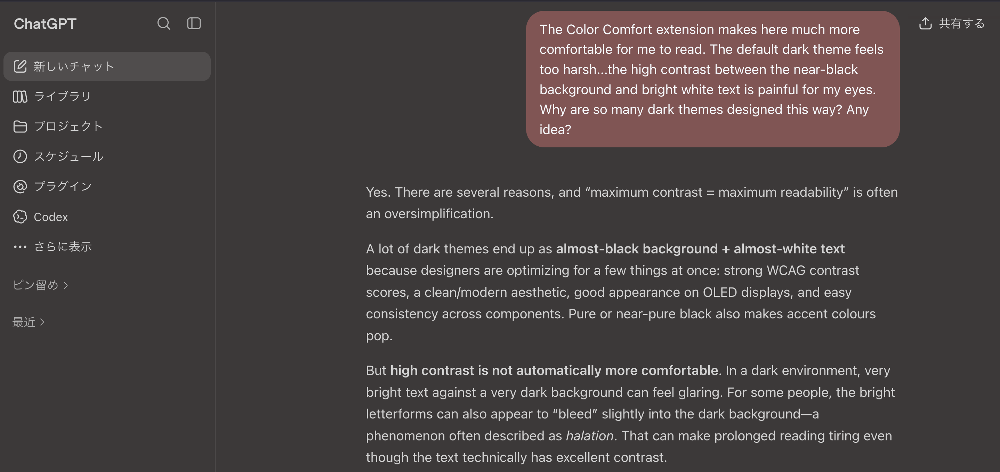

# mwx-color-comfort-chatgpt

A Firefox extension that provides a low-contrast colour theme to make ChatGPT more comfortable for people with colour vision deficiencies.

Before:

After:

Tested with Firefox 154.0 (aarch64).
